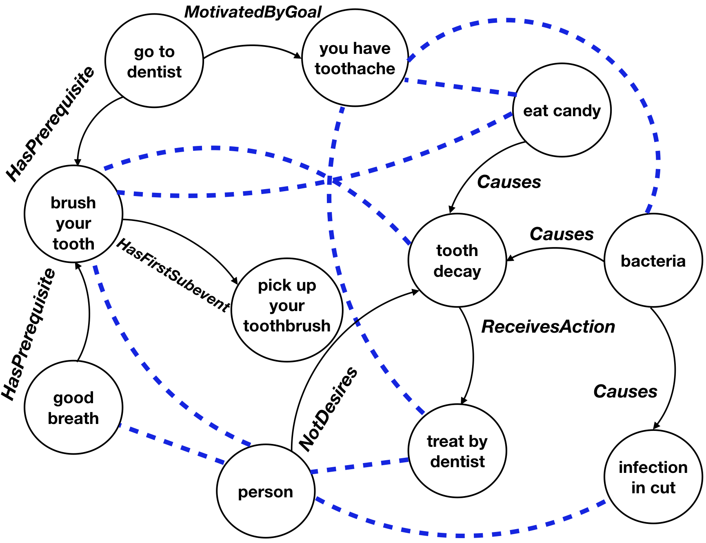

# Commonsense Knowledge Base Completion with Structural and Semantic Context

<p align="center">
 
</p>

<p align="center">
  <b>Chaitanya Malaviya, Chandra Bhagavatula, Antoine Bosselut, Yejin Choi</b></span>
</p>

Code for the paper [Commonsense Knowledge Base Completion with Structural and Semantic Context](https://arxiv.org/pdf/1910.02915.pdf). 

## Bibtex
```
@article{malaviya2020commonsense,
  title={Commonsense Knowledge Base Completion with Structural and Semantic Context},
  author={Malaviya, Chaitanya and Bhagavatula, Chandra and Bosselut, Antoine and Choi, Yejin},
  journal={Proceedings of the 34th AAAI Conference on Artificial Intelligence},
  year={2020}
}
```

## Requirements
- PyTorch
- Run `pip install -r requirements.txt` to install the required packages.

## Dataset
The ATOMIC dataset used in this paper is available [here](https://homes.cs.washington.edu/~msap/atomic/) and 
the ConceptNet graph is available [here](https://ttic.uchicago.edu/~kgimpel/commonsense.html).
For convenience, both the pre-processed version of ATOMIC and ConceptNet used in the experiments are provided at this 
[link](https://drive.google.com/file/d/1dpSK-eV_USdQ9XvqBuj2rjvtgz_97P0E/view?usp=sharing).

Note: The ATOMIC dataset was pre-processed to canonicalize person references and remove punctuations (described in `preprocess_atomic.py`.

Note: The original evaluation sets provided in the ConceptNet dataset contain correct as well as incorrect tuples for 
evaluating binary classification accuracy. `valid.txt` in `data/conceptnet` is the concatenation of the correct tuples 
from the two development sets provided in the original dataset while `test.txt` is the set of correct tuples from the original test set.


## Training 
To train a model, run the following command:
```bash
python -u src/run_kbc_subgraph.py --dataset conceptnet --evaluate-every 10 --n-layers 2
--graph-batch-size 30000 --sim_relations --bert_concat --regularization 0.1
```

This trains the model and saves the model under the `saved_models` directory.

#### Language Model Fine-tuning

In this work, we use representations from a BERT model fine-tuned to the language of the nodes in the knowledge graph.

The script to fine-tune BERT as a language model on the two knowledge graphs is present in the `lm_finetuning/` directory. 
For example, here is a command to fine-tune BERT as a language model on ConceptNet:
```bash
python lm_finetuning/simple_lm_finetuning.py --train_corpus {CONCEPTNET_TRAIN_CORPUS} --bert_model bert-large-uncased --output_dir {OUTPUT_DIR}
```

## Pre-Trained Models

We provide the fine-tuned BERT models and pre-computed BERT embeddings for both ConceptNet and ATOMIC at this [link](https://drive.google.com/file/d/1R4C2s8QWwdNE9CUwtfhsYevmM7V-01YT/view?usp=sharing). 
If you unzip the downloaded file in the root directory of the repository, the training script will load the embeddings.

We also provide the pre-trained KB completion models for both datasets for ease of use.
Link to Conceptnet [model]() and ATOMIC [model]().

## Evaluation
To evaluate a trained model and get predictions, use the following command:
```bash
CUDA_VISIBLE_DEVICES={GPU_ID} python src/run_kbc_subgraph.py --dataset conceptnet --graph-batch-size 30000 --sim_relations --bert_concat --use_bias --load_model {PATH_TO_PRETRAINED_MODEL} --eval_only --write_results
```
This will load the pre-trained model, and evaluate it on the validation and test set. The predictions are saved to `./topk_results.json`.


Please email me at chaitanyam@allenai.org for any questions.

